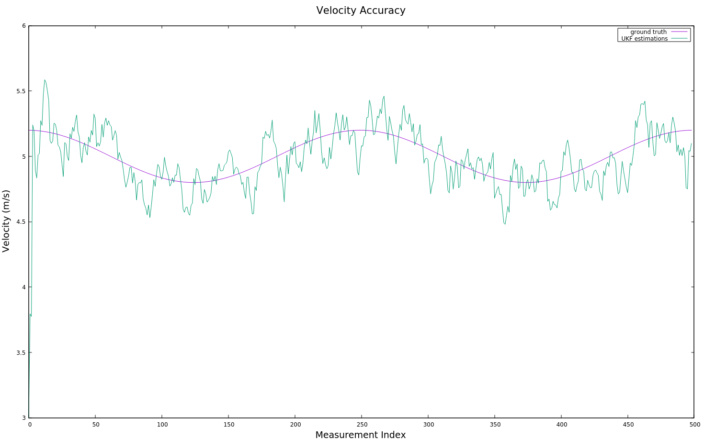

# Unscented Kalman Filter
Self-Driving Car Engineer Nanodegree Program

[//]: # (Image References)
[image1]: ./images/dataset1.png

## Project Basics
In this project, an Unscented Kalman Filter in C++ is utilized to estimate the state of a moving object of interest with noisy lidar and radar measurements. 

The motion model used here is "constant turn rate and velocity magnitude model" (CTRV). The state vector contains 5 elements, which are x coordinate postion (px), y coordinate position (py), velocity (v), yaw angle (psi), and yaw rate (psi dot). 

Here is an example of tracking a moving object.

![alt text][image1]

Red circles in the image are lidar mearsurements, and blue circles are radar measurements. Green markers are the estimated postions of the moving object from the unscented kalman filter.

## Project Setup
This project involves the Term 2 Simulator which can be downloaded [here](https://github.com/udacity/self-driving-car-sim/releases).

This repository includes two files that can be used to set up and intall [uWebSocketIO](https://github.com/uWebSockets/uWebSockets) for either Linux or Mac systems. For windows you can use either Docker, VMware, or even [Windows 10 Bash on Ubuntu](https://www.howtogeek.com/249966/how-to-install-and-use-the-linux-bash-shell-on-windows-10/) to install uWebSocketIO. Please see [this concept in the classroom](https://classroom.udacity.com/nanodegrees/nd013/parts/40f38239-66b6-46ec-ae68-03afd8a601c8/modules/0949fca6-b379-42af-a919-ee50aa304e6a/lessons/f758c44c-5e40-4e01-93b5-1a82aa4e044f/concepts/16cf4a78-4fc7-49e1-8621-3450ca938b77) for the required version and installation scripts.

Once the install for uWebSocketIO is complete, the main program can be built and ran by doing the following from the project top directory.

1. mkdir build
2. cd build
3. cmake ..
4. make
5. ./UnscentedKF

---

## Other Important Dependencies
* cmake >= 3.5
  * All OSes: [click here for installation instructions](https://cmake.org/install/)
* make >= 4.1 (Linux, Mac), 3.81 (Windows)
  * Linux: make is installed by default on most Linux distros
  * Mac: [install Xcode command line tools to get make](https://developer.apple.com/xcode/features/)
  * Windows: [Click here for installation instructions](http://gnuwin32.sourceforge.net/packages/make.htm)
* gcc/g++ >= 5.4
  * Linux: gcc / g++ is installed by default on most Linux distros
  * Mac: same deal as make - [install Xcode command line tools](https://developer.apple.com/xcode/features/)
  * Windows: recommend using [MinGW](http://www.mingw.org/)

## Results
The accuracy of the model can be shown by the residual mean squared error (RMSE) of px, py, vx, and vy between ground truth and UKF estimations.

| Variable |     RMSE     |
|:--------:|:------------:| 
| px       |     0.0661   |
| py       |     0.0827   |
| vx       |     0.3323   |
| vy       |     0.2146   |

The image below shows the trajectories of ground truth, measurements of lidar and radar, and UKF estimation.

  

Here is the comparion between velocity trajectories of ground truth and UKF estimation.

  

The two images below shows the normalized information squared (NIS) for both laser and radar noise checking. Because the variances of acceleration and yaw rate are hardcoded in the system, we need NIS to check whether the noise values are physically reasonable. 

  
  

